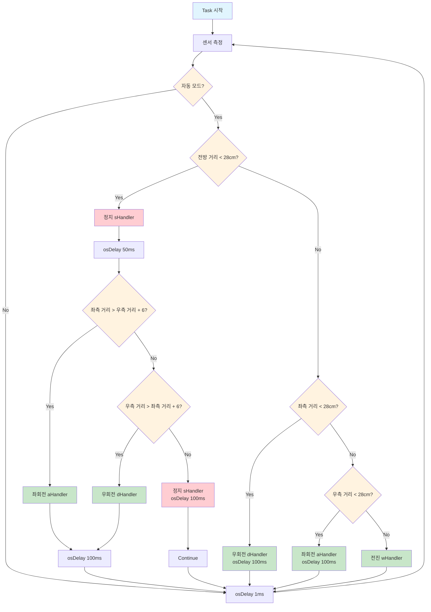

# 🚗 STM32 기반 RC카 제어 시스템 프로젝트

## 📌 개요  
STM32 마이크로컨트롤러를 기반으로 한 **RC카 제어 시스템**입니다.  

- **블루투스를 통한 수동 주행**
- **초음파 센서를 이용한 자율주행**
- **FreeRTOS 기반의 멀티태스킹 시스템 구현**

---

## 🔧 주요 기능

| 기능 | 설명 |
|------|------|
| 🕹️ 수동 주행 | 스마트폰/PC → 블루투스 문자 명령(UART) 수신 → RC카 제어 |
| 🤖 자율 주행 | 초음파 센서 거리 측정 → 장애물 감지 및 자동 회피 |
| 🔀 모드 전환 | 버튼 또는 블루투스로 수동/자율 전환 |
| 🚀 속도 조절 | '0'~'9' 문자로 PWM 값 조절 |
| 🌈 RGB 표시 | 수동(Green) / 자율(Red) 모드 표시 |
| 🛂 RFID 제어 | 등록된 RFID 태그 인식 시에만 작동 가능 |

---

## 👥 팀원 역할 (R&R)

| 이름 | 담당 역할 |
|------|-----------|
| **민형기** | RFID 인식, 부저, 전원 회로 |
| **한상진** | UART 통신, PWM 제어, 블루투스 통신 드라이버 |
| **진영제** | 초음파 센서 제어, 자율주행 알고리즘 설계 |
| **전길수** | 초기 세팅, 전원설계, FreeRTOS 태스크 구조 설계, RGB 제어, 통합 테스트 |
| **공통 진행** | 수동 제어, 하드웨어 제작, 자율 구조 기초 설계 |

---

## 🧠 시스템 흐름 요약

### 🕹️ 수동 모드
1. 블루투스 문자 수신 (`UART`)
2. `MOTOR_TASK` 활성화
3. `PWM` 제어로 RC카 움직임 제어

### 🤖 자율주행 모드
1. `HC_TASK`가 거리 측정, 자동 주행 수행
2. 장애물 판단 및 회피 방향 결정

---

## ⚙️ FreeRTOS 태스크 구조

| 태스크 | 기능 |
|--------|------|
| **RGB_TASK** | 모드별 LED 표시 |
| **HC_TASK** | 초음파 거리 측정 주기적 수행 |
| **MOTOR_TASK** | UART 명령 또는 HC_TASK 결과 기반 RC카 제어 |

---

## 📽️ 동작 시연 영상  
- 🔗 [수동 주행 영상](https://www.youtube.com/shorts/ISOO37JSwbE)  
- 🔗 [자율주행 영상](https://www.youtube.com/watch?v=L4taoACXe-A&feature=youtu.be)

---

## ⚠️ 문제점 및 해결 방안

### 1. 초음파 센서 오작동
- **문제**: 거리 측정 불안정, 노이즈, 시야각 한계  
- **해결**: 평균 필터, 거리 임계값 조정, 노이즈 제거 로직 추가

### 2. 속도 조절 한계
- **문제**: 저속 불안정, 모터 좌우 불균형  
- **해결**: PWM 곡선 적용, 속도 단계 추가(G, H, I, J 등)

---

## 🔍 회고 및 개선 방향

- **임베디드 시스템 설계 및 FreeRTOS 병렬 제어 경험**  
- **하드웨어 연동 실전 체험 (모터/센서/블루투스)**  
- **실제 문제 해결 경험 및 안정성 향상**

> ✅ 현재는 한 코스를 완주하는 데 집중하고 있으며,  
> 향후에는 코스 변경에도 유연하게 대응하는 정밀한 자율주행을 목표로 개선 예정입니다.

---

    B --> C[Left 센서 측정 osDelay 10ms]
    C --> D[Front 센서 측정 osDelay 10ms]
    D --> E[Right 센서 측정 osDelay 10ms]
    E --> F[거리값 보정 0 또는 400 초과시 400으로 설정]

